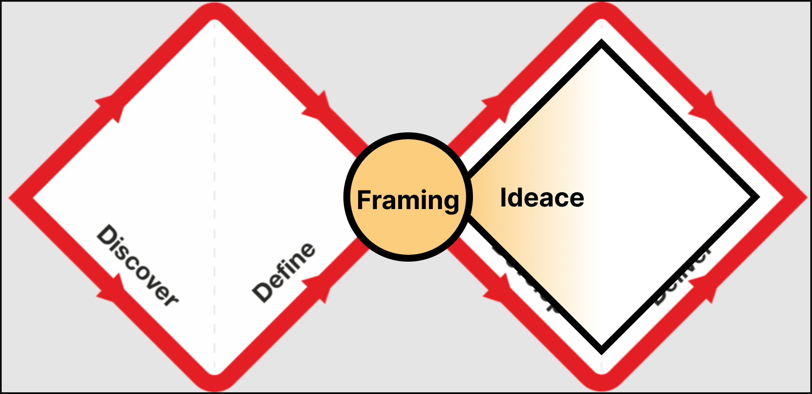

---
hideInToc: true
---

# This is the MUNI Arts theme

Headings use **Muni** (the university's own display face) with a Helvetica/Arial fallback if the real font isn't loaded locally - this text is in the plain sans stack, same as it'll read in the built public site.

- MUNI blue `#0000dc` for headings and accents
- Faculty of Arts blue `#4bc8ff` as the secondary accent
- KISK's own logo, hotlinked live from MUNI's CDN

---
layout: heading-body
hideInToc: true
---

# Agenda

This is what a real session opening would look like - the headings below also drive the progress bar at the bottom of the screen, section by section.

<Toc minDepth="1" maxDepth="1" />

---
layout: section-break
---

# Warm-up

---
layout: heading-body
hideInToc: true
---

# Warm-up

Dummy placeholder content, standing in for whatever a real warm-up activity slide would hold.

---
layout: section-break
---

# Concept input

---
layout: heading-body
hideInToc: true
---

# Concept input

Dummy placeholder content.

---
layout: section-break
---

# Hands-on exercise

---
layout: heading-body
hideInToc: true
---

# Hands-on exercise

Dummy placeholder content.

---
layout: section-break
---

# Debrief & homework

---
layout: heading-body
hideInToc: true
---

# Debrief & homework

Dummy placeholder content.

---
layout: heading-body
hideInToc: true
---

# Layout gallery

One example of each of the eight content layouts below - test content, for tuning these together, not real session copy yet.

---
layout: heading-body
hideInToc: true
---

# What changes this run

- AI tooling woven through every session, not a standalone topic
- Same second-diamond focus as spring 2025 - problem framing through delivery
- Seven 100-minute sessions instead of six 160-minute ones

---
layout: quote
author: Erika Hall
hideInToc: true
---

Research isn't one thing - different questions need different kinds of looking.

---
layout: two-column
ratio: "60-40"
hideInToc: true
---

# Double diamond, still the spine

::left::

- Discover the right problem, then build the thing right
- A guiding principle, not a dogma
- This course lives in the second diamond

::right::

---
layout: section-break
---

# Part II

Theory, methods, and the team-project brief

---
layout: groupwork
hideInToc: true
---

# What shifted for you today?

Not what you learned - what's different in how you'd approach the next real problem.

---
layout: homework
hideInToc: true
---

# Before session 2

- Form your team (3-5 people)
- Pick one of the nine candidate topics, or bring your own
- Come ready to pitch it in two minutes

---
layout: full-image
image: ../../../img/design/workshop.jpg
credit: Erik Vaněk
hideInToc: true
---

# Session 1, spring 2025

---
layout: break
hideInToc: true
---

# Break

10 minutes
